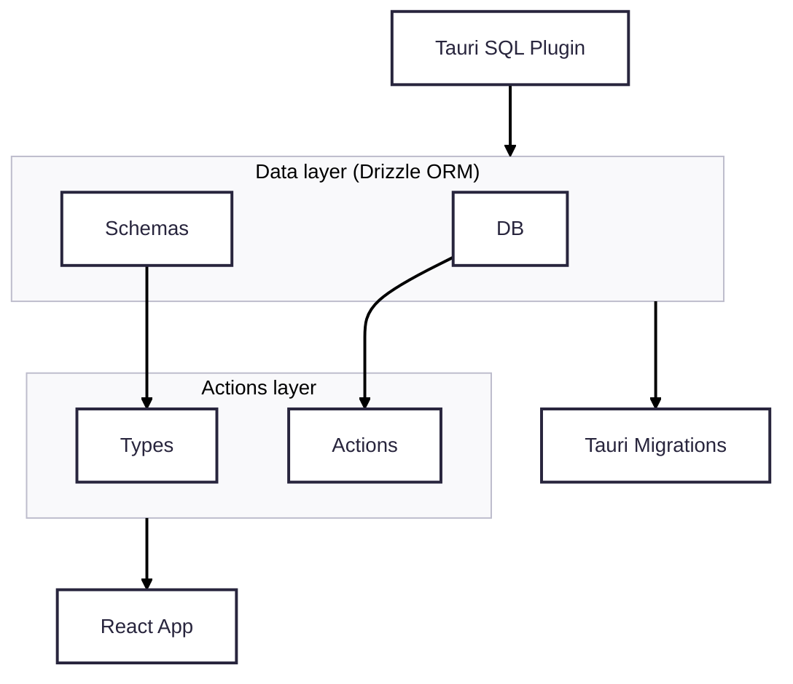

# Smart Home App

<p align="center">
  
  <br>
  <em>Minimalist cross-platform application Built with Tauri, React, and TypeScript. Local sqlite database, lazy routes, qr code for sharing devices.</em>
  <br>
</p>

<p align="center">
  
  •
  
  •
  
  •
   
  <br>
  
  •
  
</p>

A modern, cross-platform desktop application for managing my ESP devices. Built with Tauri, React, and TypeScript, this app provides an easy and modern interface for controlling and organizing my devices and a way to share the device configuration with others.

> [!NOTE]
>
> - Currently, the app only supports switches running a custom firmware. However, the system is designed to be easily extensible for other device types in the future.
> - The custom firmware is not yet uploaded—please check the [TODO section](TODO.md) for updates.

## 🏠 Features

### Smart Home Control

- **Real-time Control**: Control devices directly from the app
- **Device States**: Monitor and control device states (on/off, brightness, etc.)
- **Pinned Devices**: Pin frequently used devices for quick access
- **Pinned Rooms**: Pin important rooms for easy navigation

### Device Management

- **Add/Remove Devices**: Easily add new smart devices to your home network
- **Device Organization**: Group devices by rooms for better organization
- **Device Types**: Support for various smart device types (lights, sensors, etc.)
- **QR Code Integration**: Scan QR codes to quickly add devices
- **Device Sharing**: Share device information with others via QR codes

### Room Management

- **Room Creation**: Create and organize rooms in your home
- **Room Customization**: Add descriptions and icons to rooms
- **Device Assignment**: Assign devices to specific rooms
- **Room Overview**: View all devices in each room

### User Experience

- **Modern UI**: Clean, responsive interface built with Tailwind CSS
- **Dark/Light Theme**: Toggle between dark and light themes
- **Cross-platform**: Works, at least, on Windows and Android

## 🛠️ Tech Stack

### Frontend

- **React 19** - React with latest features
- **TypeScript** - Type-safe development
- **Tailwind CSS** - Utility-first CSS framework
- **React Router** - Client-side routing
- **React Hook Form** - Form handling with validation
- **Zod** - Schema validation
- **TanStack Query** - Data fetching and caching
- **Zustand** - State management
- **Lucide React** - Beautiful icons

### Backend & Database

- **Tauri** - Cross-platform desktop app framework
- **Rust** - Backend logic and system integration
- **SQLite** - Local database
- **Drizzle ORM** - Type-safe database operations

### Development Tools

- **Vite** - Fast build tool and dev server
- **ESLint** - Code linting
- **Prettier** - Code formatting
- **Drizzle Kit** - Database migrations

## 📱 Usage

For detailed instructions on how to add, edit, and manage devices and rooms, see the [Usage Guide](./USAGE.md).

## 📦 Installation

### Prerequisites

- **Node.js** (v18 or higher)
- **pnpm** (recommended) or npm
- **Rust** (latest stable version)
- **Tauri CLI**

### Setup Instructions

1. **Clone the repository**

   ```bash
   git clone <repository-url>
   cd smart-home-app
   ```

2. **Install dependencies**

   ```bash
   pnpm install
   ```

3. **Install Tauri CLI** (if not already installed)

   ```bash
   cargo install tauri-cli
   ```

4. **Run the development server**
   ```bash
   pnpm dev
   ```

## 🚀 Available Scripts

- `pnpm dev` - Start development server with Tauri
- `pnpm vite:dev` - Start Vite dev server only
- `pnpm build` - Build the application for production
- `pnpm lint` - Run ESLint
- `pnpm format` - Format code with Prettier
- `pnpm preview` - Preview production build
- `pnpm migrate` - Generate database migrations

## 🏗️ Project Structure

```
smart-home-app/
├── src/
│   ├── actions/          # "Server" actions for data operations
│   ├── components/       # Reusable UI components
│   ├── features/         # Feature-based organization
│   │   ├── devices/      # Device management features
│   │   ├── home/         # Home dashboard features
│   │   ├── rooms/        # Room management features
│   │   └── scan-qr/      # QR code scanning features
│   ├── hooks/            # Custom React hooks
│   ├── lib/              # Utility libraries and database
│   ├── router/           # Application routing
│   ├── store/            # State management
│   └── types/            # TypeScript type definitions
└── src-tauri/            # Tauri backend (Rust)
    └── migrations/       # Database migrations
```

## 🔧 Configuration

### Database

The app uses SQLite with Drizzle ORM. Database migrations are handled automatically through Drizzle Kit but, currently, needs to be pasted on the Rust side.

Originally, at least on desktop, the `migrate()` function handle the migrations automatically and tauri was in charge of add the `migrations/` folder to the bundle but for some [bug](https://github.com/tauri-apps/tauri/issues/8911) the android build is unable to access to the bundled resources.

The app uses SQLite as its local database, managed through Drizzle ORM for type-safe operations. Database migrations are generated automatically using Drizzle Kit. However, due to current platform limitations, these migration strings (`src-tauri/migrations/`) must be manually copied to the Rust backend (`src-tauri/src/migrations.rs`).

On desktop platforms, the `migrate()` function can automatically apply migrations, with Tauri bundling the `migrations/` folder as part of the application. However, due to a [known issue](https://github.com/tauri-apps/tauri/issues/8911), the Android build cannot access bundled resources, so migrations must be handled manually.

## Data & Actions Layer ("API Layer")

The app implements a structured "API layer" inspired by [this architecture](https://profy.dev/article/react-architecture-api-layer), organized as a **Data-Actions layer**. This approach separates concerns and provides a clean interface for the React app to interact with persistent data, similar to "Server Actions" in Next.js.



## 🤝 Contributing

1. Fork the repository
2. Create a feature branch (`git checkout -b feature/amazing-feature`)
3. Commit your changes (`git commit -m 'Add some amazing feature'`)
4. Push to the branch (`git push origin feature/amazing-feature`)
5. Open a Pull Request

## 📄 License

This project is licensed under the MIT License - see the [LICENSE](LICENSE) file for details.

## 🐛 Troubleshooting

### Common Issues

**Build fails with Tauri errors:**

- Ensure Rust is properly installed and up to date
- Check that all Tauri dependencies are installed
- Run `cargo clean` and try building again

**Database migration issues:**

- Run `pnpm migrate` to generate new migrations
- Copy the migration string into `src-tauri/src/migrations.rs` if it is necessary
- Check that the database file is writable

**Development frontend issues:**

- Clear node_modules and reinstall dependencies
- Ensure all prerequisites are properly installed

---

Built with ❤️ using Tauri and React
